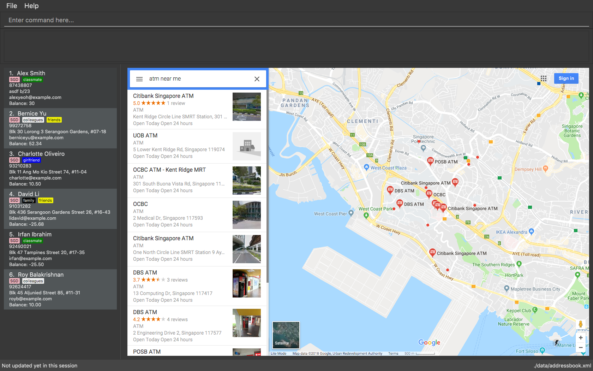

= TravelBanker
ifdef::env-github,env-browser[:relfileprefix: docs/]

https://travis-ci.org/se-edu/addressbook-level4[image:https://travis-ci.org/se-edu/addressbook-level4.svg?branch=master[Build Status]]
https://ci.appveyor.com/project/damithc/addressbook-level4[image:https://ci.appveyor.com/api/projects/status/3boko2x2vr5cc3w2?svg=true[Build status]]
https://coveralls.io/github/se-edu/addressbook-level4?branch=master[image:https://coveralls.io/repos/github/se-edu/addressbook-level4/badge.svg?branch=master[Coverage Status]]
https://gitter.im/se-edu/Lobby[image:https://badges.gitter.im/se-edu/Lobby.svg[Gitter chat]]

ifdef::env-github[]

endif::[]

ifndef::env-github[]
image::images/Ui.png[width="600"]
endif::[]

== Introduction

* This is a desktop java application that helps people, particularly travellers, to informally keep accounts with other people.
* Record how much money you owe someone, or someone owes to you, plus much more!
* Most of your user interactions are via command line, while there exists a GUI (Graphical User Interface).

== Getting Started
For developers, please refer to the "DeveloperGuide.adoc" under "Section 1. Setting Up"
and ensure the steps are properly followed.

For users, please refer to the "UserGuide.adoc" for instructions on how to
use the application.

Below is a list of useful links to the relevant documents to get you started.

== Site Map

* <<UserGuide#, User Guide>>
* <<DeveloperGuide#, Developer Guide>>
* <<AboutUs#, About Us>>
* <<ContactUs#, Contact Us>>

== Running Tests
To run the tests for this application, ensure that you are using IntelliJ IDE, and:

 [FOR DEVELOPERS]
 1. Create your own automated tests for your relevant features
 2. Under "src/", right-click on the "test" folder and select "Run 'All Tests'"

 [FOR USERS]
 1. Under "src/", right-click on the "test" folder and select "Run 'All Tests'"

== Built With
- IntelliJ IDE - Software Development
- GitHub - Source Control

== Authors (in Alphabetical Order)
- Artsiom Skliar - Developer
- Chen Chongsong - Developer
- Eric Lingfeng Zhou - Developer
- Prian Kuhanandan - Developer

== Acknowledgements

* Some parts of this sample application were inspired by the excellent http://code.makery.ch/library/javafx-8-tutorial/[Java FX tutorial] by
_Marco Jakob_.
* Libraries used: https://github.com/TomasMikula/EasyBind[EasyBind], https://github.com/TestFX/TestFX[TextFX], https://bitbucket.org/controlsfx/controlsfx/[ControlsFX], https://github.com/FasterXML/jackson[Jackson], https://github.com/google/guava[Guava], https://github.com/junit-team/junit4[JUnit4]
* Source code is based on the  https://github.com/se-edu/addressbook-level4[AddressBook-Level4] project created by SE-EDU initiative.

== Licence : link:LICENSE[MIT]
